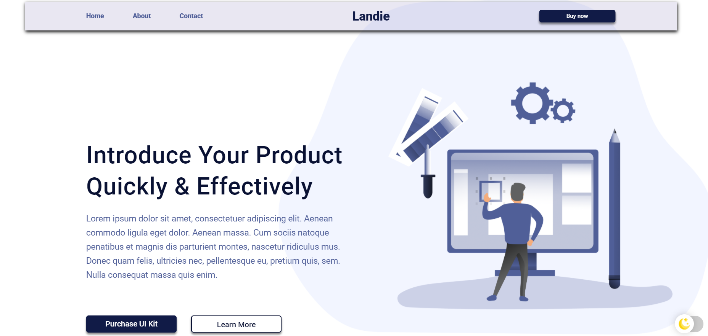
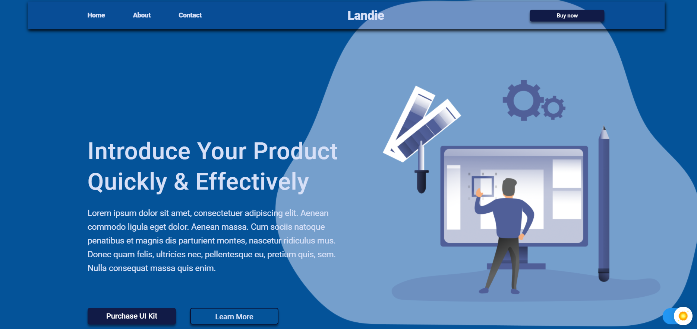

# Landing page
> A common landing page made with SCSS, HTML and a little JS

## Table of contents
* [General info](#general-info)
* [Screenshots](#screenshots)
* [Technologies](#technologies)
* [Status](#status)

## General info
You can find this website loyaut - [here](https://www.figma.com/file/tZvin19JmGnT1qPJVLmt0m/Figma-Website-Template-Landie-Demo-Community?node-id=0%3A88)  
[DEMO](https://ic3top.github.io/Landie/dist/index.html)
___
Page’s performance score according to PageSpeed Insights: _94 - mobiles_ / _99 - computers_  
I used gulp as a blunder and SCSS. Also I have applied animations and Bootstrap Reboot.

## Screenshots

## Technologies
* animate.css  v4.1.1
* Bootstrap Reboot v4.3.1 (https://getbootstrap.com/)

## Features
List of features ready
* Themes (dark/basic)
* Modal window
* Cool animations:)

## Status
Project is: _finished_
